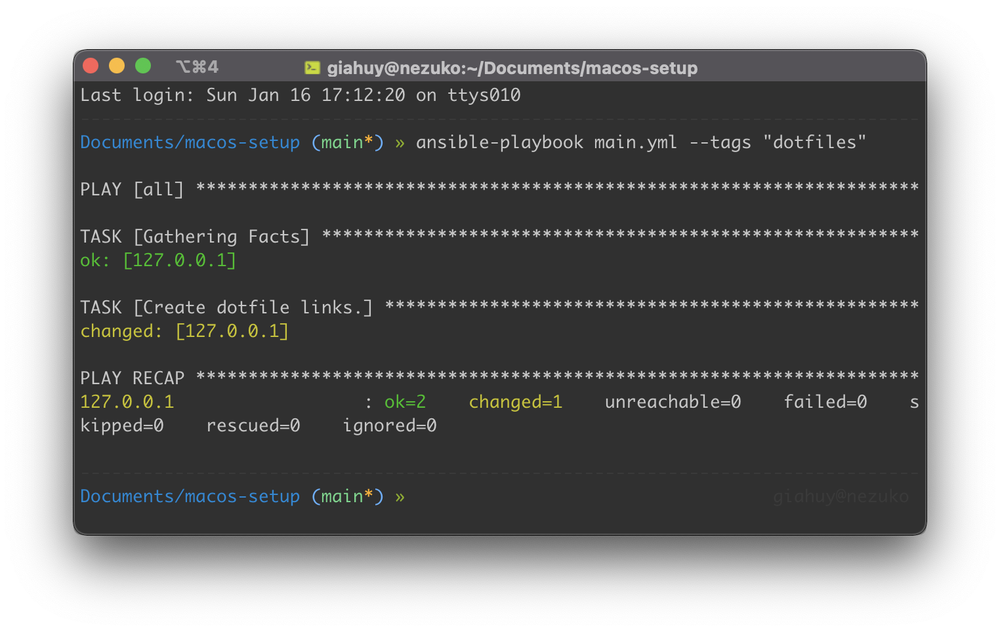

# macos-setup

This serves as a guide to help my future self setup his computer.



Reinstalling your OS once in a while can be fun; you get to discover new features and tweak them to your liking knowing that they will save you time later on. However, working with an OS for a long time makes it become bulkier and less migratable with the sheer volume of files and documents that you have got too attached and familiar to give up. And Among those, there are files that bear parts of your personality, knowledge and experience (I mean these folders).

> I got inspired by [Jeff Geerling's repo](https://github.com/geerlingguy/mac-dev-playbook), so here is my version.

## How to use

Do it if you want your system to be like mine.

1. Install Apple's command line tools

```
xcode-select --install
```

2. Install Python3
3. Install Ansible

```
pip3 install ansible
```

4. Clone and `cd` this repo
5. Get the requirements

```
ansible-galaxy install -r requirements.yml
```

6. Launch it

```
ansible-playbook main.yml -K
```

> Add flag --tags "tag1,tag2" if you only want to run tasks with those tags

## Manual tasks

After the automation, there are some files and config to be import manually from `exports/`

-   Restore `.zsh_history`
-   Check jdk, pip versions
-   Install pip3 packages
-   Import IntelliJ, PrusaSlicer settings
-   Add Internet Accounts to System Preferences
-   Login Chrome, VSCode, IntelliJ, Google Drive, AdGuard
-   Copy back documents (Time Machine)
-   Install Minecraft
-   Install private softwares

## How does it work

Ansible is a cli tool that lets you define tasks where you write your commands and Ansible will then run them sequentially. All of these tasks are in `main.yml`. Basically you can set task name to some predefined commands such as 'copy' or 'move', but I personally prefer them to invoke my shell scripts in `scripts/`.

Ansible also has roles, and collections which can be used to include other people's prewritten tasks into your playbook. And the way to customize your imported tasks is via variables defined in `config.yml`.

## Disclaimer

This playbook can only set up System Preferences, and a small part of Finder, e.g. adding and removing folder from Finder sidebar still has to be done manually. Large files and documents which are too sensitive to be put online still have to be saved and copied back manually with _Time Machine_.
